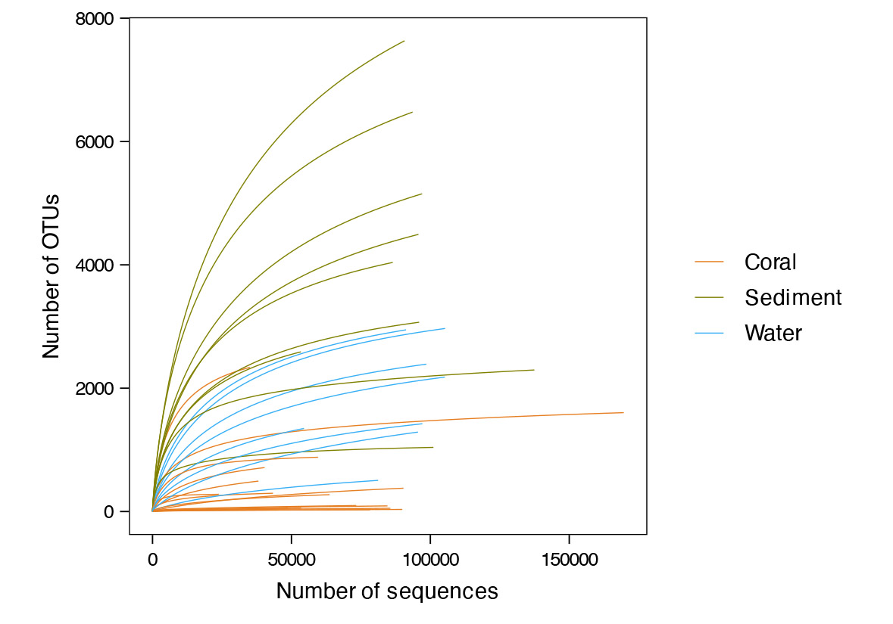
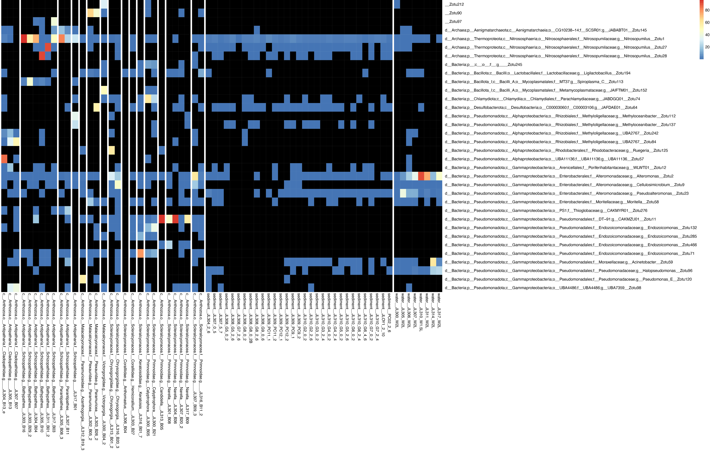
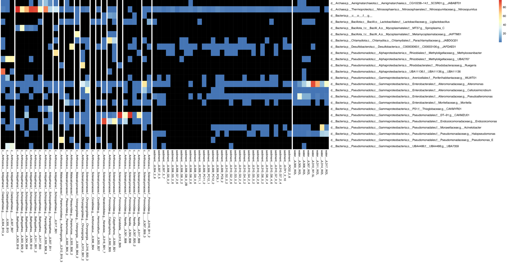

Rarefaction Curve
---

+ [Script and example input files](Rarefaction)

+ To get the rarefaction curve, get the input files ready, update the five lines at the bottom of `rarefaction.py` and run:

      python3 rarefaction.py

Community Composition (stacked bar plot)
---

+ [script and example input files](community_composition)

      python3 Stacked_bar_plot.py -m metadata.txt -otu OTU_Table.txt -otu_c OTU_Taxa.txt -w 12 -hr "sc,o,f" -mr "d" -o Coral_community_composition.pdf -sample interested_sample.txt

NMDS
---

+ [script and example input files](NMDS)

+ To get the NMDS plot , get the input files ready, update the lines at the bottom of `NMDS.py` and run:

      python3 NMDS.py

Pheatmap ASV
---

+ [script and example input files](pheatmapASV)

      python3 pheatmapASV.py -na -m metadata.txt -otu_c OTU_Taxa.txt -combine_asv o,f,g -olr d,p,c,o,f,g -oar f -slr c,o,f,g -sar sc -otu ASV_Table_pct.txt -o output_folder/pheatmapASV.pdf

+ Plot individual ASV

+ Combine ASVs at genus level

  