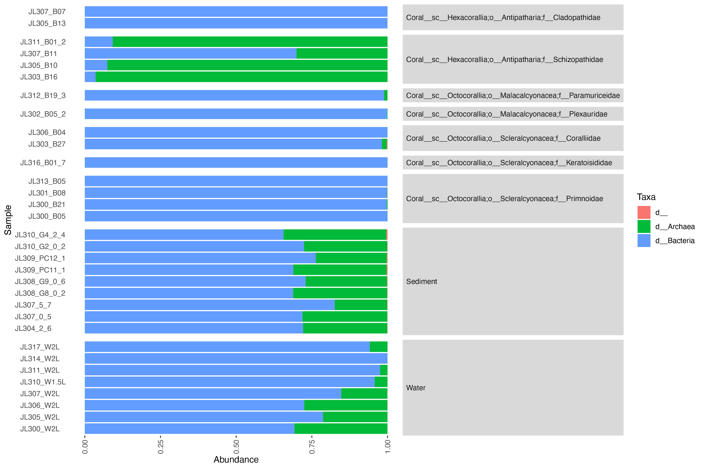

rarefaction curve
---

+ To get the rarefaction curve, get the input files ready, update the five lines at the bottom of `rarefaction.py` and run:

      python3 rarefaction.py

community composition (Stacked_bar_plot)
---

    python3 Stacked_bar_plot.py -m metadata.txt -otu OTU_Table.txt -otu_c OTU_Taxa.txt -w 12 -hr "sc,o,f" -mr "d" -o Coral_community_composition.pdf -sample interested_sample.txt

NMDS
---

pheatmapASV
---

